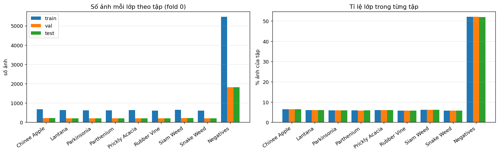
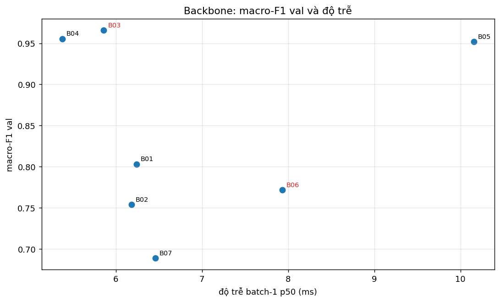
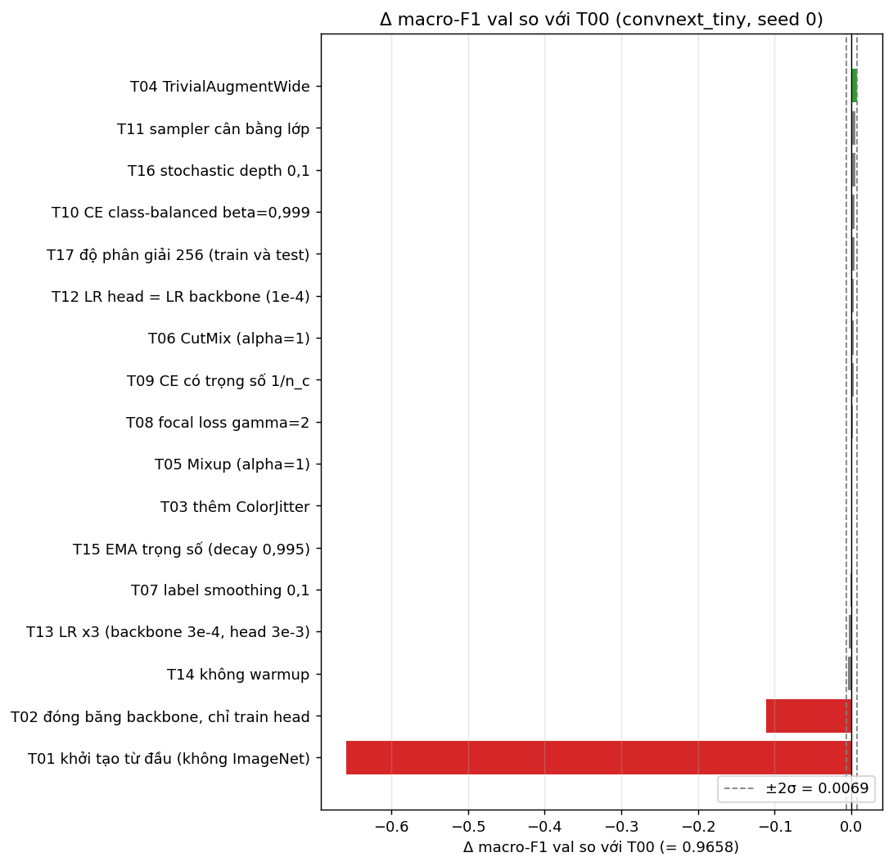
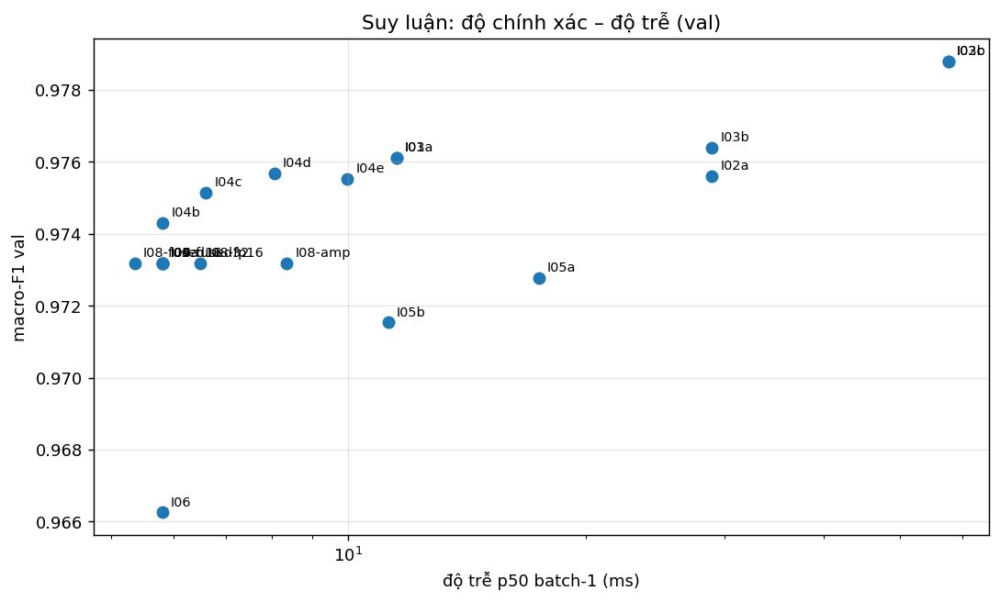
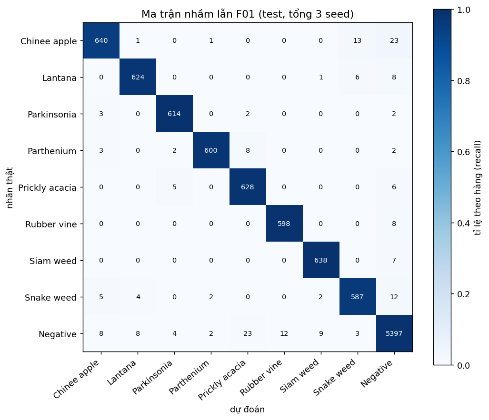
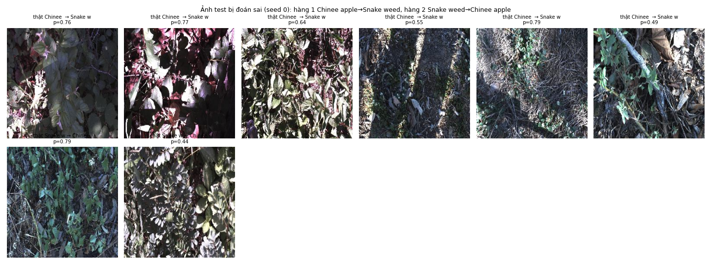

# Báo cáo Lab Day 2 — Nguyễn Thanh Hòa — 2A202602559

> Mọi bảng và con số đến từ lần chạy đầy đủ trên Kaggle (T4); log từng run ở `results/runs/<exp_id>/seed<k>/`, bảng ở `results.xlsx`. Δ = chênh macro-F1 val so với `T00` seed 0; mọi lựa chọn dựa trên **val**, test chạy một lần cho mỗi checkpoint.

## 1. Tóm tắt

- Bài toán: phân loại 9 lớp DeepWeeds (fold 0, 10.501/3.501/3.507 ảnh train/val/test). 7 backbone, 17 thí nghiệm công thức huấn luyện + T20 (kết hợp), 20 cấu hình suy luận.
- Cấu hình tốt nhất (chốt bằng val): convnext_tiny + T04: aug=trivial + suy luận tencrop/prob K=10 + temperature scaling.
- **Test (3 seed, mean ± std): macro-F1 0.9765 ± 0.0009, top-1 0.9815 ± 0.0010, ECE 0.0056 ± 0.0004**; mốc T00+I00: macro-F1 0.9705 ± 0.0039, top-1 0.9773 ± 0.0025; Δ macro-F1 = +0.0060 (vượt std lớn hơn 0.0039).
- Cấu hình thời gian thực R01: convnext_tiny + T04: aug=trivial + 1 view + fused16 + temperature scaling (thời gian thực): p95 5.8 ms (batch 1), macro-F1 test 0.9736 ± 0.0018.
- **Kết luận chính:**
  - (1) *Backbone/trọng số tiền huấn luyện đóng góp nhiều nhất*: với cùng công thức nền, ConvNeXt-T, DeiT-S, Swin-T đạt macro-F1 val 0,952–0,966, còn ResNet-50, ResNeXt-50, EfficientNet-B0, MobileNetV3-L chỉ 0,689–0,803 (chênh tới ~0,28).
  - (2) *Công thức huấn luyện cho thêm rất ít*: trong 17 thí nghiệm chỉ TrivialAugment (+0,0074 val) vượt nhẹ ngưỡng nhiễu 0,0069, các yếu tố còn lại nằm trong nhiễu (ngoại trừ huấn luyện từ đầu và đóng băng backbone làm hại rõ).
  - (3) *Suy luận*: 10-crop TTA thêm +0,0029 macro-F1 test (cả 3 seed đều tăng) với chi phí ~10× độ trễ; temperature scaling giảm ECE test 0,0068 → 0,0056 mà không đổi F1. Tổng cải thiện so với mốc là +0,0060 macro-F1 test: cả 3 seed F01 (0,9760–0,9775) cao hơn cả 3 seed mốc (0,9660–0,9729).
  - *Điều bất ngờ:* các CNN dùng BatchNorm với cùng LR 1e-4 học chậm hơn nhiều (train loss cuối 0,14–0,30, so với 0,01 của ConvNeXt-T), và cặp nhầm kinh điển Chinee apple ↔ Snake weed không còn là nguồn lỗi chính: ~70% lỗi liên quan lớp `Negative`.

## 2. Dữ liệu và thiết lập

- Dataset DeepWeeds, fold 0 chia sẵn (`train/val/test_subset0.csv`), không sửa; kiểm tra: giao các cặp tập rỗng, hợp đủ 17.509 ảnh, mọi file tồn tại.

| lớp | train | val | test | total |
|---|---|---|---|---|
| Chinee Apple | 675 | 225 | 226 | 1126 |
| Lantana | 637 | 213 | 213 | 1063 |
| Parkinsonia | 618 | 206 | 207 | 1031 |
| Parthenium | 613 | 204 | 205 | 1022 |
| Prickly Acacia | 637 | 212 | 213 | 1062 |
| Rubber Vine | 605 | 202 | 202 | 1009 |
| Siam Weed | 644 | 215 | 215 | 1074 |
| Snake Weed | 609 | 203 | 204 | 1016 |
| Negatives | 5463 | 1821 | 1822 | 9106 |

Đối chiếu với Table 1 của bài báo:

| lớp | đếm được (tôi) | Table 1 bài báo | lệch |
|---|---|---|---|
| Chinee Apple | 1126 | 1125 | 1 |
| Lantana | 1063 | 1064 | -1 |
| Parkinsonia | 1031 | 1031 | 0 |
| Parthenium | 1022 | 1022 | 0 |
| Prickly Acacia | 1062 | 1062 | 0 |
| Rubber Vine | 1009 | 1009 | 0 |
| Siam Weed | 1074 | 1074 | 0 |
| Snake Weed | 1016 | 1016 | 0 |
| Negatives | 9106 | 9106 | 0 |

- Chỉ số: macro-F1 (chính), top-1, balanced accuracy, F1/recall từng lớp, ECE 15 bin; mean ± std (ddof = 1) qua 3 seed. Chọn mọi thứ trên val; test một lần mỗi checkpoint.
- Công thức nền: AdamW (LR backbone 1e-4, head 1e-3, wd 0,05 không áp dụng cho norm/bias), warmup 1 epoch + cosine, CE, batch 64, 12 epoch, AMP, RandomResizedCrop(224, scale 0,25–1) + lật ngang; val/test center-crop 224.
- Môi trường: Tesla T4, PyTorch 2.11.0+cu128, timm 1.0.29, Python 3.13.15. Seed 0/1/2. Tái lập: cudnn.benchmark bật nên không tái lập từng bit trên GPU.
- **Nhận xét EDA:** `Negative` chiếm 52% (9.106 ảnh), mỗi loài 1.009–1.126 ảnh, tỉ lệ lớp lớn/nhỏ = 9,02×. Vì vậy đoán luôn `Negative` đã được top-1 ≈ 52% nhưng macro-F1 chỉ ≈ 0,076, nên chỉ số chính phải là macro-F1. Chia fold 0 đúng 59,97/20,00/20,03%, không giao nhau, hợp đủ 17.509 ảnh, mọi file tồn tại. Số đếm lệch Table 1 của bài báo ở Chinee apple (1.126 so với 1.125) và Lantana (1.063 so với 1.064), tổng vẫn 17.509 (chưa tìm nguyên nhân). Ảnh gốc đều 256×256 RGB; mean RGB ≈ (0,376; 0,388; 0,378) và std ≈ 0,235 (đo trên 1.500 ảnh), tối hơn ImageNet, nhưng vì dùng trọng số `timm` nên chuẩn hoá theo mean/std của chính trọng số. Qua ảnh mẫu (`figures/eda_samples.png`): ảnh chụp ngoài đồng, nền lẫn đất, lá khô, cỏ và bóng đổ mạnh, đôi khi lệch màu (ngả xanh/hồng); cây mục tiêu nhiều ảnh nhỏ hoặc thưa trong khung hình. Chinee apple, Lantana, Snake weed và Rubber vine đều là cây lá rộng nên bằng mắt dễ nhầm với nhau; Parkinsonia, Prickly acacia và nhiều ảnh `Negative` là đất/thảm mục có ít chi tiết cây.

## 3. So sánh backbone

| exp_id | backbone | tag trọng số | tham số (M) | GMAC | độ phân giải | epoch | seed | macro-F1 val | top-1 val | thời gian train/epoch (s) | độ trễ batch-1 p50 (ms) | độ trễ batch-1 p95 (ms) | ghi chú |
|---|---|---|---|---|---|---|---|---|---|---|---|---|---|
| B01 | resnet50 | resnet50 (timm/resnet50.a1_in1k) | 23.5265 | 4.0872 | 224 | 12 | 0 | 0.8030 | 0.8555 | 35.5476 | 6.2410 | 6.6769 |  |
| B02 | resnext50_32x4d | resnext50_32x4d (timm/resnext50_32x4d.a1h_in1k) | 22.9983 | 4.2285 | 224 | 12 | 0 | 0.7539 | 0.8018 | 45.6034 | 6.1820 | 6.6049 |  |
| B03 | convnext_tiny | convnext_tiny (timm/convnext_tiny.in12k_ft_in1k) | 27.8270 | 4.4548 | 224 | 12 | 0 | 0.9658 | 0.9726 | 52.8192 | 5.8610 | 6.3497 |  |
| B04 | deit_small_patch16_224 | deit_small_patch16_224 (timm/deit_small_patch16_224.fb_in1k) | 21.6691 | 4.5985 | 224 | 12 | 0 | 0.9556 | 0.9677 | 34.8018 | 5.3785 | 6.8511 |  |
| B05 | swin_tiny_patch4_window7_224 | swin_tiny_patch4_window7_224 (timm/swin_tiny_patch4_window7_224.ms_in1k) | 27.5263 | 4.4898 | 224 | 12 | 0 | 0.9519 | 0.9640 | 66.8473 | 10.1563 | 10.6131 |  |
| B06 | efficientnet_b0 | efficientnet_b0 (timm/efficientnet_b0.ra_in1k) | 4.0191 | 0.3845 | 224 | 12 | 0 | 0.7717 | 0.8292 | 28.9233 | 7.9305 | 8.8348 | mạng nhẹ |
| B07 | mobilenetv3_large_100 | mobilenetv3_large_100 (timm/mobilenetv3_large_100.ra_in1k) | 4.2136 | 0.2153 | 224 | 12 | 0 | 0.6888 | 0.7758 | 16.7932 | 6.4571 | 6.7576 | mạng nhẹ |

- Chọn đi tiếp: convnext_tiny (B03) có macro-F1 val cao nhất (0.9658), độ trễ batch-1 p50 5.9 ms, 27.8M tham số; mạng nhẹ tốt nhất là efficientnet_b0 (B06): macro-F1 0.7717, p50 7.9 ms.
- **Nhận xét:** thứ hạng macro-F1 val: ConvNeXt-T 0,9658 > DeiT-S 0,9556 > Swin-T 0,9519 ≫ ResNet-50 0,8030 > EfficientNet-B0 0,7717 > ResNeXt-50 0,7539 > MobileNetV3-L 0,6888.
  - *Khác dự đoán:* transformer (DeiT-S, Swin-T) không kém mà xấp xỉ ConvNeXt-T, còn ResNet-50/ResNeXt-50 thấp hơn rất xa, và ResNeXt-50 thấp hơn ResNet-50 (ngược thứ hạng ImageNet). Mạng nhẹ thấp hơn như dự đoán nhưng chênh tới 0,19–0,28.
  - *Hội tụ/quá khớp (từ `curves/` và `runs/*/history.csv`):* ConvNeXt-T, DeiT-S, Swin-T hội tụ nhanh (ConvNeXt-T đã đạt F1 val 0,839 sau epoch 1) và train loss cuối chỉ 0,011–0,025 nên khoảng cách val−train loss ≈ 0,09–0,11 (hơi quá khớp); ngược lại bốn CNN dùng BatchNorm học chậm và khái quát kém: train loss cuối 0,30 (ResNet-50), 0,15 (ResNeXt-50), 0,14 (EfficientNet-B0), 0,16 (MobileNetV3-L), cao hơn ConvNeXt-T 13–28 lần, cùng val loss 0,43–0,69; F1 val còn tăng ở epoch 12 (ResNet-50: 0,794 ở epoch 6 → 0,803 ở epoch 12). Giải thích khả dĩ (chưa kiểm chứng): LR backbone 1e-4 với AdamW và 12 epoch quá thấp/không hợp cho các trọng số CNN này (tag `a1_in1k`, `a1h_in1k`, `ra_in1k` huấn luyện bằng công thức riêng); công thức nền không được chỉnh riêng cho từng backbone.
  - *Biến nhiễu quan trọng:* trọng số ConvNeXt-T là `in12k_ft_in1k` (tiền huấn luyện trên ImageNet-12k lớn hơn), trong khi các mạng khác là ImageNet-1k, nên không thể quy khoảng cách cho riêng kiến trúc (câu hỏi GUIDE mục 9, câu 1).
  - *FLOPs không dự đoán độ trễ:* GMAC từ 0,22 đến 4,60 nhưng độ trễ batch-1 chỉ 5,4–10,2 ms; Swin-T (4,49 GMAC) chậm gấp ~1,7× ConvNeXt-T (4,45 GMAC), và EfficientNet-B0 (0,38 GMAC, ít hơn ResNet-50 ~11×) lại chậm hơn ResNet-50 (7,9 so với 6,2 ms); hạng độ trễ so với hạng GMAC có Spearman −0,43, trong khi thời gian train/epoch bám theo số tham số/GMAC hơn (Spearman 0,64–0,89). Ở batch 1 trên T4, độ trễ bị chi phối bởi số lượng và loại kernel chứ không phải số phép nhân.
  - *Lý do chọn đi tiếp:* ConvNeXt-T có macro-F1 val cao nhất với độ trễ ngang các mạng khác (5,9 ms) nên không có đánh đổi nào buộc phải chọn mạng khác; mạng nhẹ tốt nhất (EfficientNet-B0) vừa kém F1 vừa không nhanh hơn trên T4.

## 4. Công thức huấn luyện

`T00` (convnext_tiny) 3 seed: 0.9688 ± 0.0035; ngưỡng nhiễu = max(2σ, 0,003) = 0.0069. Các thí nghiệm khác 1 seed (seed 0), tham lam theo trục.

| exp_id | backbone | trục | khác T00 ở điểm nào | seed | macro-F1 val | top-1 val | Δ so với T00 | vượt nhiễu (\|Δ\| > ngưỡng)? | recall Chinee Apple | recall Snake Weed | F1 thấp nhất theo lớp | ghi chú |
|---|---|---|---|---|---|---|---|---|---|---|---|---|
| T00 | convnext_tiny | - | công thức nền (seed 0) | 0 | 0.9658 | 0.9726 | 0.0000 | Không (không phân biệt được) | 0.9156 | 0.9310 | 0.9333 |  |
| T00 | convnext_tiny | - | công thức nền (seed 1) | 1 | 0.9681 | 0.9754 | 0.0024 | Không (không phân biệt được) | 0.9156 | 0.9458 | 0.9320 |  |
| T00 | convnext_tiny | - | công thức nền (seed 2) | 2 | 0.9726 | 0.9794 | 0.0068 | Không (không phân biệt được) | 0.9333 | 0.9606 | 0.9420 |  |
| T01 | convnext_tiny | A | khởi tạo từ đầu (không ImageNet) | 0 | 0.3070 | 0.5373 | -0.6588 | Có | 0.1956 | 0.2020 | 0.0690 |  |
| T02 | convnext_tiny | A | đóng băng backbone, chỉ train head | 0 | 0.8549 | 0.8846 | -0.1109 | Có | 0.7911 | 0.7783 | 0.7521 |  |
| T03 | convnext_tiny | B | thêm ColorJitter | 0 | 0.9665 | 0.9729 | 0.0008 | Không (không phân biệt được) | 0.9111 | 0.8916 | 0.9211 |  |
| T04 | convnext_tiny | B | TrivialAugmentWide | 0 | 0.9732 | 0.9791 | 0.0074 | Có | 0.9333 | 0.9557 | 0.9395 |  |
| T05 | convnext_tiny | B | Mixup (alpha=1) | 0 | 0.9672 | 0.9743 | 0.0014 | Không (không phân biệt được) | 0.8978 | 0.9310 | 0.9130 |  |
| T06 | convnext_tiny | B | CutMix (alpha=1) | 0 | 0.9683 | 0.9763 | 0.0026 | Không (không phân biệt được) | 0.9067 | 0.9458 | 0.9209 |  |
| T07 | convnext_tiny | C | label smoothing 0,1 | 0 | 0.9644 | 0.9717 | -0.0014 | Không (không phân biệt được) | 0.9289 | 0.9212 | 0.9212 |  |
| T08 | convnext_tiny | C | focal loss gamma=2 | 0 | 0.9682 | 0.9754 | 0.0025 | Không (không phân biệt được) | 0.9244 | 0.9064 | 0.9177 |  |
| T09 | convnext_tiny | C | CE có trọng số 1/n_c | 0 | 0.9683 | 0.9754 | 0.0026 | Không (không phân biệt được) | 0.9289 | 0.9458 | 0.9298 |  |
| T10 | convnext_tiny | C | CE class-balanced beta=0,999 | 0 | 0.9701 | 0.9774 | 0.0044 | Không (không phân biệt được) | 0.9244 | 0.9212 | 0.9350 |  |
| T11 | convnext_tiny | D | sampler cân bằng lớp | 0 | 0.9711 | 0.9771 | 0.0053 | Không (không phân biệt được) | 0.9378 | 0.9409 | 0.9227 |  |
| T12 | convnext_tiny | E | LR head = LR backbone (1e-4) | 0 | 0.9693 | 0.9754 | 0.0035 | Không (không phân biệt được) | 0.9156 | 0.9310 | 0.9310 |  |
| T13 | convnext_tiny | E | LR x3 (backbone 3e-4, head 3e-3) | 0 | 0.9624 | 0.9712 | -0.0034 | Không (không phân biệt được) | 0.9067 | 0.9310 | 0.9220 |  |
| T14 | convnext_tiny | E | không warmup | 0 | 0.9610 | 0.9697 | -0.0048 | Không (không phân biệt được) | 0.9333 | 0.8867 | 0.9114 |  |
| T15 | convnext_tiny | F | EMA trọng số (decay 0,995) | 0 | 0.9663 | 0.9734 | 0.0005 | Không (không phân biệt được) | 0.8978 | 0.9458 | 0.9287 |  |
| T16 | convnext_tiny | F | stochastic depth 0,1 | 0 | 0.9706 | 0.9771 | 0.0049 | Không (không phân biệt được) | 0.9111 | 0.9409 | 0.9340 |  |
| T17 | convnext_tiny | G | độ phân giải 256 (train và test) | 0 | 0.9695 | 0.9763 | 0.0038 | Không (không phân biệt được) | 0.9422 | 0.9261 | 0.9330 |  |
| T20 | convnext_tiny | kết hợp | kết hợp T04 | 0 | 0.9732 | 0.9791 | 0.0074 | Có | 0.9333 | 0.9557 | 0.9395 |  |

- Công thức tốt nhất: T04: aug=trivial.
- **Nhận xét theo trục** (nhiễu: σ = 0,0035 từ 3 seed `T00`, ngưỡng 0,0069; các Δ dưới đây tính so với `T00` seed 0 = 0,9658; mỗi thí nghiệm chỉ 1 seed).
  - **A. Khởi tạo (khớp dự đoán):** huấn luyện từ đầu (`T01`) macro-F1 0,307 (−0,659) và đóng băng backbone (`T02`) 0,855 (−0,111): với 10,5k ảnh và 12 epoch, từ đầu hầu như không học được (train loss cuối 1,18 ⇒ underfit nặng, LR không được chỉnh lại cho trường hợp này) còn đặc trưng ImageNet đóng băng đã khá nhưng tinh chỉnh toàn bộ còn thêm ~0,11.
  - **B. Augmentation:** chỉ TrivialAugment (`T04`) vượt ngưỡng (+0,0074); ColorJitter (+0,0008), Mixup (+0,0014) và CutMix (+0,0026) không phân biệt được với nhiễu. Dự đoán 'Mixup/CutMix có thể hại' không xảy ra nhưng cũng không giúp. Cơ chế gợi ý bởi số liệu: baseline hơi quá khớp (train loss 0,011 so với val loss 0,107), TrivialAugment làm train loss tăng lên 0,035 và val loss giảm xuống 0,081, tức chính quy hoá thật sự; tuy vậy Δ = 0,0074 chỉ nhỉnh hơn ngưỡng 0,0069 một chút, và `T00` seed 2 đã đạt 0,9726 (gần bằng 0,9732 của `T04`); nếu coi hiệu của hai run đơn lẻ có std √2·σ thì ngưỡng là 0,0099 và `T04` không vượt; `T04` còn là giá trị lớn nhất trong 17 so sánh nên có thể là 'may mắn' (winner's curse). Kết luận về `T04` vì thế chỉ mang tính gợi ý.
  - **C. Loss:** label smoothing (−0,0014), focal (+0,0025), CE trọng số 1/n_c (+0,0026), class-balanced (+0,0044) đều trong nhiễu. Đúng hướng dự đoán, loss/sampler có trọng số tăng recall trung bình 8 loài (0,9605 → 0,9694 với `T09`, 0,9735 với sampler cân bằng `T11`) và giảm nhẹ recall `Negative` (0,9841 → 0,9813 và 0,9808); nhưng mỗi lớp loài chỉ có 225 ảnh val (1 ảnh = 0,44 điểm recall) nên các thay đổi này nằm trong nhiễu lấy mẫu.
  - **D. Sampler cân bằng:** +0,0053 (không phân biệt được).
  - **E. LR:** LR head = LR backbone (+0,0035), LR ×3 (−0,0034), bỏ warmup (−0,0048) đều trong nhiễu: ConvNeXt-T tinh chỉnh khá bền với LR trong khoảng ×3 (ít nhạy hơn dự đoán).
  - **F. Chính quy hoá:** EMA (+0,0005) và stochastic depth 0,1 (+0,0049) không phân biệt được. Đường cong cho thấy EMA vượt xa trọng số thô giữa chừng (epoch 5: F1 0,966 so với 0,940) nhưng đến epoch 12 hai bên bằng nhau (0,964), vì lịch cosine về 0 đã tự làm mượt cuối quá trình.
  - **G. Độ phân giải 256:** +0,0038 (không phân biệt được) với chi phí huấn luyện 68 so với 50 s/epoch (+35%).
  - **Kết hợp:** chỉ có một yếu tố vượt ngưỡng nên `T20` trùng cấu hình `T04` (kết quả y hệt 0,9732): *chưa thử được kết hợp thật*, nên chưa kết luận được cộng dồn hay triệt tiêu. Năm yếu tố có Δ dương nhưng dưới ngưỡng (`T10`, `T11`, `T12`, `T16`, `T17`: +0,0035…+0,0053) chưa được kết hợp; đây là hạn chế của cách chọn tham lam theo ngưỡng.
  - **Tóm lại:** với ConvNeXt-T, huấn luyện từ đầu/đóng băng làm hại rất rõ; còn lại công thức huấn luyện đóng góp ≲ 0,007 macro-F1, nhỏ hơn nhiều so với lựa chọn backbone (chênh tới 0,28).

## 5. Suy luận

| exp_id | phương pháp | mô hình/checkpoint | K | macro-F1 val | top-1 val | ECE val | NLL val | độ trễ p50 (ms) | độ trễ p95 (ms) | độ trễ p99 (ms) | thông lượng (ảnh/s) | chi phí tương đối so với I00 | ghi chú |
|---|---|---|---|---|---|---|---|---|---|---|---|---|---|
| I00 | 1 view (center-crop 224), mốc | T04/seed0 (convnext_tiny) | 1 | 0.9732 | 0.9791 | 0.0090 | 0.0813 | 5.8135 | 5.9201 | 6.0791 | 209.9102 | 1.0000 |  |
| I01 | TTA hflip K=2, gộp xác suất | T04/seed0 (convnext_tiny) | 2 | 0.9761 | 0.9820 | 0.0077 | 0.0750 | 11.5102 | 11.7206 | 11.7707 | 106.9327 | 1.9799 |  |
| I03a | TTA hflip K=2, gộp logit | T04/seed0 (convnext_tiny) | 2 | 0.9761 | 0.9820 | 0.0065 | 0.0747 | 11.5102 | 11.7206 | 11.7707 | 106.9327 | 1.9799 |  |
| I02a | TTA fivecrop K=5, gộp xác suất | T04/seed0 (convnext_tiny) | 5 | 0.9756 | 0.9809 | 0.0072 | 0.0735 | 28.8926 | 30.2343 | 30.6152 | 42.5177 | 4.9699 |  |
| I03b | TTA fivecrop K=5, gộp logit | T04/seed0 (convnext_tiny) | 5 | 0.9764 | 0.9814 | 0.0080 | 0.0742 | 28.8926 | 30.2343 | 30.6152 | 42.5177 | 4.9699 |  |
| I02b | TTA tencrop K=10, gộp xác suất | T04/seed0 (convnext_tiny) | 10 | 0.9788 | 0.9837 | 0.0060 | 0.0697 | 57.5587 | 58.6065 | 74.5582 | 21.1831 | 9.9008 |  |
| I03c | TTA tencrop K=10, gộp logit | T04/seed0 (convnext_tiny) | 10 | 0.9788 | 0.9837 | 0.0068 | 0.0696 | 57.5587 | 58.6065 | 74.5582 | 21.1831 | 9.9008 |  |
| I04a | độ phân giải test: crop224 | T04/seed0 (convnext_tiny) | 1 | 0.9732 | 0.9791 | 0.0090 | 0.0813 | 5.8127 | 6.2622 | 7.0401 | 212.5061 | 1.0000 | đầu vào 224x224 |
| I04b | độ phân giải test: resize224 | T04/seed0 (convnext_tiny) | 1 | 0.9743 | 0.9797 | 0.0092 | 0.0773 | 5.8160 | 6.2043 | 6.3499 | 212.4367 | 1.0006 | đầu vào 224x224 |
| I04c | độ phân giải test: full256 | T04/seed0 (convnext_tiny) | 1 | 0.9751 | 0.9806 | 0.0072 | 0.0735 | 6.5963 | 6.7360 | 6.8992 | 164.8470 | 1.1348 | đầu vào 256x256 |
| I04d | độ phân giải test: resize288 | T04/seed0 (convnext_tiny) | 1 | 0.9757 | 0.9814 | 0.0072 | 0.0686 | 8.0624 | 8.8194 | 10.1746 | 124.2186 | 1.3870 | đầu vào 288x288 |
| I04e | độ phân giải test: resize320 | T04/seed0 (convnext_tiny) | 1 | 0.9755 | 0.9803 | 0.0086 | 0.0751 | 9.9670 | 10.1616 | 10.2053 | 105.3775 | 1.7147 | đầu vào 320x320 |
| I05a | ensemble 3 seed T00 (trung bình xác suất) | T00/seed0-2 (convnext_tiny) | 3 | 0.9728 | 0.9791 | 0.0074 | 0.0759 | 17.4406 | 17.7602 | 18.2373 | 69.9701 | 3.0000 | thành viên: macro-F1 [0.9658, 0.9681, 0.9726] |
| I05b | ensemble 2 backbone tốt nhất (B-run, T00) | B03+B04 | 2 | 0.9715 | 0.9780 | 0.0090 | 0.0873 | 11.2395 | 13.2008 | 13.2008 | 88.9716 | 1.9333 | p99 xấp xỉ bằng tổng p95; thành viên: [0.9658, 0.9556] |
| I06 | trọng số EMA (decay 0,995) so với trọng số thô | T15/seed0 (convnext_tiny) | 1 | 0.9663 | 0.9734 | 0.0047 | 0.0991 | 5.8135 | 5.9201 | 6.0791 | 209.9102 | 1.0000 | EMA (AMP) 0.9663 vs thô (AMP) 0.9399 tại epoch tốt nhất; không tốn thêm khi suy luận |
| I07 | temperature scaling (T = 1.377, khớp trên val) | T04/seed0 (convnext_tiny) | 1 | 0.9732 | 0.9791 | 0.0049 | 0.0737 | 5.8135 | 5.9201 | 6.0791 | 209.9102 | 1.0000 | ECE val 0.0090 -> 0.0049; NLL 0.0813 -> 0.0737 (khớp và đo cùng trên val nên là trong mẫu) |
| I08-fused32 | gộp BN vào conv, FP32 | T04/seed0 (convnext_tiny) | 1 | 0.9732 | 0.9791 | 0.0090 | 0.0813 | 5.8111 | 5.9706 | 6.2004 | 211.8614 | 0.9996 | không có BN để gộp (LayerNorm): không áp dụng |
| I08-amp | AMP (autocast FP16) | T04/seed0 (convnext_tiny) | 1 | 0.9732 | 0.9791 | 0.0090 | 0.0814 | 8.3550 | 9.0106 | 9.1818 | 596.9715 | 1.4372 |  |
| I08-fp16 | FP16 (model.half()) | T04/seed0 (convnext_tiny) | 1 | 0.9732 | 0.9791 | 0.0090 | 0.0813 | 6.4880 | 8.2852 | 8.8533 | 728.7100 | 1.1160 |  |
| I08-fused16 | gộp BN + FP16 | T04/seed0 (convnext_tiny) | 1 | 0.9732 | 0.9791 | 0.0090 | 0.0813 | 5.3599 | 5.7941 | 6.1210 | 727.9855 | 0.9220 | không có BN để gộp (LayerNorm): không áp dụng |

- Suy luận cuối: tencrop, gộp prob, K = 10, + temperature scaling; thời gian thực: fused16 (5.4 ms p50 / 5.8 ms p95).
- Độ trễ đo đúng cách: warmup, `cuda.synchronize`, 100 lần đo, p50/p95/p99, không tính tiền xử lý (xem sheet `Latency`).
- **Nhận xét** (trên val, mô hình `T04` seed 0, ConvNeXt-T, GPU T4; mốc I00 macro-F1 0,9732, 5,8 ms p50).
  - **TTA:** lật ngang (K=2) 0,9761 (+0,0029, 2,0× độ trễ), 5-crop (K=5) 0,9756/0,9764 (+0,0024/+0,0032; 5,0×), 10-crop (K=10) 0,9788 (+0,0056; 9,9×). F1 tăng nhẹ theo K nhưng mỗi mức đều nhỏ hơn hoặc gần bằng nhiễu (σ ≈ 0,0035); NLL cải thiện rõ hơn (0,0813 → 0,0697, −14%). Trên test (post-hoc, chỉ để phân tích, không dùng chọn cấu hình), 10-crop đổi nhãn so với crop giữa ở 75 lượt dự đoán (3 seed): 46 từ sai thành đúng, 20 từ đúng thành sai, nên TTA có sửa nhiều hơn làm hỏng nhưng cũng làm hỏng ca đã đúng (đúng như cảnh báo ở GUIDE mục 8).
  - **Gộp xác suất vs logit (I03):** F1 chênh ≤ 0,0008 và ECE chênh ≤ 0,0012, tức không phân biệt được.
  - **Độ phân giải test (I04):** crop 224 0,9732 → resize 224 0,9743 → ảnh nguyên 256 0,9751 → 288 0,9757 → 320 0,9755; cao nhất ở 288 (+0,0025, 1,4× độ trễ, NLL 0,0813 → 0,0686). Xu hướng phù hợp FixRes (RandomResizedCrop làm vật thể to hơn lúc train nên test ở độ phân giải cao hơn bù lại), nhưng mức tăng nhỏ hơn nhiễu nên chưa khẳng định.
  - **Ensemble (I05):** 3 seed `T00` 0,9728 so với trung bình thành viên 0,9688 (+0,0040) và so với thành viên tốt nhất 0,9726 (+0,0002) với 3× độ trễ; ensemble ConvNeXt-T + DeiT-S 0,9715 so với 0,9658 của ConvNeXt-T (+0,0057) với 1,9× độ trễ: lợi ích nhỏ, hợp ngoại tuyến.
  - **EMA (I06):** miễn phí lúc suy luận; so với trọng số thô cùng run, EMA vượt rõ ở giữa quá trình (epoch 5: 0,966 so với 0,940) nhưng ở cuối bằng nhau, nên với 12 epoch + cosine EMA không đem lại lợi ích thêm.
  - **Temperature scaling (I07):** T = 1,377 > 1 (mô hình hơi quá tự tin); ECE val 0,0090 → 0,0049, NLL 0,0813 → 0,0737, F1/accuracy không đổi (khớp và đo cùng trên val nên là trong mẫu). Trên test, ECE F01: 0,0068 ± 0,0008 → 0,0056 ± 0,0004: lợi ích tuyệt đối nhỏ vì ECE gốc đã dưới 1%.
  - **FP16/AMP/gộp BN (I08):** F1, top-1 và ECE không đổi (0,9732/0,9791/0,0090). Gộp BN không áp dụng được với ConvNeXt-T (dùng LayerNorm). Ở batch 1, AMP *chậm hơn* FP32 (8,4 so với 5,8 ms, +44%, do chi phí chuyển kiểu) và FP16 thuần 6,5 ms; hai dòng `FP16` (6,5 ms) và `gộp BN + FP16` (5,4 ms) thực chất là cùng một phép tính (không có BN để gộp) nhưng lệch 1,1 ms, tức sai khác dưới ~1 ms (≈ 20% ở thang 5–6 ms) là nhiễu đo, không nên diễn giải. Ở batch 32 FP16 cho 729 ảnh/s so với 210 ảnh/s của FP32 (3,5×), tức tensor core chỉ có lợi khi batch lớn.
  - **Ngoại tuyến vs thời gian thực:** TTA và ensemble tốn K× độ trễ, hợp xử lý ngoại tuyến; EMA, temperature scaling và FP16 (khi batch lớn) không tốn thêm. Dù 10-crop (57,6 ms p50, 58,6 ms p95) vẫn dưới ngân sách 100 ms trên T4, đây không phải phần cứng robot (bài báo đo 53–180 ms cho ResNet-50 trên Jetson TX2), nên với robot nên dùng một view + temperature scaling (R01).

## 6. Cấu hình tốt nhất và chung kết

| exp_id | cấu hình | seed | macro-F1 val | macro-F1 test | top-1 test | ECE test | mean ± std qua seed |
|---|---|---|---|---|---|---|---|
| F01 | convnext_tiny + T04: aug=trivial + suy luận tencrop/prob K=10 + temperature scaling | 0 | 0.9791 | 0.9775 | 0.9826 | 0.0051 |  |
| F01 | convnext_tiny + T04: aug=trivial + suy luận tencrop/prob K=10 + temperature scaling | 1 | 0.9738 | 0.9760 | 0.9806 | 0.0057 |  |
| F01 | convnext_tiny + T04: aug=trivial + suy luận tencrop/prob K=10 + temperature scaling | 2 | 0.9760 | 0.9760 | 0.9812 | 0.0059 |  |
| F01 | convnext_tiny + T04: aug=trivial + suy luận tencrop/prob K=10 + temperature scaling (tổng hợp) | mean ± std (n=3) | 0.9763 | 0.9765 | 0.9815 | 0.0056 | F1 test 0.9765 ± 0.0009; top-1 0.9815 ± 0.0010; ECE 0.0056 ± 0.0004 |
| T00 | convnext_tiny + công thức nền + 1 view (mốc T00+I00) | 0 | 0.9658 | 0.9726 | 0.9778 | 0.0088 |  |
| T00 | convnext_tiny + công thức nền + 1 view (mốc T00+I00) | 1 | 0.9681 | 0.9660 | 0.9746 | 0.0129 |  |
| T00 | convnext_tiny + công thức nền + 1 view (mốc T00+I00) | 2 | 0.9726 | 0.9729 | 0.9795 | 0.0099 |  |
| T00 | convnext_tiny + công thức nền + 1 view (mốc T00+I00) (tổng hợp) | mean ± std (n=3) | 0.9688 | 0.9705 | 0.9773 | 0.0105 | F1 test 0.9705 ± 0.0039; top-1 0.9773 ± 0.0025; ECE 0.0105 ± 0.0021 |
| R01 | convnext_tiny + T04: aug=trivial + 1 view + fused16 + temperature scaling (thời gian thực) | 0 | — | 0.9733 | 0.9783 | 0.0053 |  |
| R01 | convnext_tiny + T04: aug=trivial + 1 view + fused16 + temperature scaling (thời gian thực) | 1 | — | 0.9720 | 0.9780 | 0.0045 |  |
| R01 | convnext_tiny + T04: aug=trivial + 1 view + fused16 + temperature scaling (thời gian thực) | 2 | — | 0.9755 | 0.9803 | 0.0044 |  |
| R01 | convnext_tiny + T04: aug=trivial + 1 view + fused16 + temperature scaling (thời gian thực) (tổng hợp) | mean ± std (n=3) | — | 0.9736 | 0.9789 | 0.0047 | F1 test 0.9736 ± 0.0018; top-1 0.9789 ± 0.0012; ECE 0.0047 ± 0.0005 |

| lớp | số ảnh test | precision F01 | recall F01 | f1 F01 | recall T00 | f1 T00 | F1 F01 (seed tốt nhất) |
|---|---|---|---|---|---|---|---|
| Chinee apple | 226 | 0.9712 | 0.9440 | 0.9573 | 0.9351 | 0.9541 | 0.9575 |
| Lantana | 213 | 0.9797 | 0.9765 | 0.9781 | 0.9703 | 0.9779 | 0.9858 |
| Parkinsonia | 207 | 0.9824 | 0.9887 | 0.9856 | 0.9758 | 0.9790 | 0.9808 |
| Parthenium | 205 | 0.9918 | 0.9756 | 0.9836 | 0.9756 | 0.9788 | 0.9829 |
| Prickly acacia | 213 | 0.9501 | 0.9828 | 0.9662 | 0.9718 | 0.9532 | 0.9676 |
| Rubber vine | 202 | 0.9805 | 0.9868 | 0.9836 | 0.9736 | 0.9801 | 0.9901 |
| Siam weed | 215 | 0.9816 | 0.9891 | 0.9853 | 0.9876 | 0.9726 | 0.9884 |
| Snake weed | 204 | 0.9640 | 0.9592 | 0.9615 | 0.9526 | 0.9534 | 0.9561 |
| Negative | 1822 | 0.9876 | 0.9874 | 0.9875 | 0.9863 | 0.9855 | 0.9887 |

- So với số tham khảo của bài báo (trích dẫn, điều kiện khác: 100 epoch, augmentation mạnh): ResNet-50 95,7%, Inception-v3 95,1%; Chinee apple 88,5%, Snake weed 88,8%.
- **Mô tả để tái lập:** `convnext_tiny` (timm `convnext_tiny.in12k_ft_in1k`), head 9 lớp, tinh chỉnh toàn bộ; train: RandomResizedCrop(224, scale 0,25–1) + lật ngang + TrivialAugmentWide, AdamW (LR backbone 1e-4, head 1e-3, weight decay 0,05 không áp dụng cho norm/bias), warmup 1 epoch + cosine về 0, CE, batch 64, 12 epoch, AMP FP16, chọn checkpoint theo macro-F1 val; suy luận: 10 view (4 góc + giữa của crop 224 từ ảnh 256, và bản lật), trung bình xác suất, chia nhiệt độ T khớp trên val của từng seed (1,24–1,29); seed 0/1/2; Kaggle Tesla T4, PyTorch 2.11.0+cu128, timm 1.0.29; mã nguồn và notebook trong `code/`.
- **So với mốc:** F01 macro-F1 test 0,9765 ± 0,0009 so với mốc T00+I00 0,9705 ± 0,0039: Δ = +0,0060, lớn hơn std lớn hơn trong hai nhóm (0,0039) ~1,5 lần nhưng nhỏ hơn 2σ của mốc (0,0078), nên là bằng chứng vừa phải; đáng tin hơn là cả 3 seed F01 (0,9760; 0,9760; 0,9775) cao hơn cả 3 seed mốc (0,9660; 0,9726; 0,9729) — tách hoàn toàn (xác suất xảy ra ngẫu nhiên với 3 so 3 là 1/20 = 0,05, một phía).
  - Top-1 98,15% so với 97,73%; số lỗi 195/10.521 so với 239 (−18%).
  - Tách theo thành phần (test): mốc → R01 (công thức `T04` + temperature scaling, 1 view, FP16) 0,9736 (+0,0031, các seed còn chồng lấn với mốc) → F01 (thêm 10-crop TTA) 0,9765 (+0,0029, cả 3 seed F01 đều trên cả 3 seed R01). Mỗi thành phần riêng lẻ chỉ ở mức nhiễu; chúng cộng lại mới đủ rõ. Chênh lệch val–test của F01 chỉ 0,0002 (0,9763 so với 0,9765).
- **Phân tích lỗi:** F1 thấp nhất theo lớp: Chinee apple 0,957 (recall 94,4%), Snake weed 0,962 (recall 95,9%) và Prickly acacia 0,966 (precision chỉ 0,950). So với bài báo (ResNet-50, 88,5% và 88,8% recall) cao hơn rất nhiều, nhưng *không phải so sánh cùng điều kiện* (bài báo: 100 epoch, 5 fold, độ chính xác trung bình có trọng số; ở đây ConvNeXt-T tiền huấn luyện ImageNet-12k; ResNet-50 của chính tôi dưới công thức nền chỉ đạt top-1 val 85,6%).
  - Cặp nhầm kinh điển Chinee apple ↔ Snake weed giảm còn 1,9% và 0,8% (bài báo 3,4% và 4,1%) và không còn là lỗi chính: trong 195 lỗi (tổng 3 seed), 137 (70,3%) liên quan `Negative` (68 loài bị đoán là `Negative`, 69 ảnh `Negative` bị đoán là một loài), chỉ 58 (29,7%) là nhầm giữa hai loài.
  - Các cặp lớn nhất: Chinee apple → `Negative` 23 (3,4% lớp), `Negative` → Prickly acacia 23, Chinee apple → Snake weed 13, Snake weed → `Negative` 12, `Negative` → Rubber vine 12, Parthenium → Prickly acacia 8.
  - Qua ảnh sai (`figures/errors_chinee_snake.png`) giả thuyết (chưa kiểm chứng): ảnh Chinee/Snake bị nhầm là tán lá rộng tối dưới bóng đổ mạnh nên hình dạng lá khó phân biệt, và một số ảnh gần như chỉ có đất/thảm mục với cây nhỏ hoặc thưa nên nhãn loài chỉ dựa trên vài chi tiết nhỏ (có thể bị crop 224 cắt bớt); `Negative` bị nhầm thành Prickly acacia/Rubber vine/Siam weed có thể do ảnh đất–cỏ chứa cây non của loài đó (nhãn nhiễu theo định nghĩa `Negative` = thực vật không phải loài mục tiêu).
  - Chia ngẫu nhiên không theo địa điểm nên ảnh test có thể rất giống ảnh train cùng điểm chụp, làm các số trên lạc quan.

## 7. Kết luận và khuyến nghị

- **Cấu hình tốt nhất:** ConvNeXt-T + TrivialAugment + 10-crop TTA + temperature scaling (F01): macro-F1 test 0,9765 ± 0,0009, top-1 98,15%, ECE 0,0056; so với mốc `T00+I00` (0,9705 ± 0,0039) cao hơn +0,0060, tách hoàn toàn theo seed nhưng chỉ ~1,5× std.
  - **Yếu tố đóng góp nhiều nhất:** backbone/trọng số tiền huấn luyện (chênh tới ~0,28 macro-F1 val giữa ConvNeXt-T và MobileNetV3-L, ~0,16 so với ResNet-50 với công thức nền), sau đó là suy luận (TTA ≈ +0,003, temperature scaling chủ yếu cải thiện hiệu chuẩn) và công thức huấn luyện (≲ +0,007, phần lớn trong nhiễu); khuyến cáo thận trọng vì khoảng cách backbone bị lẫn với khác biệt trọng số tiền huấn luyện và với việc không chỉnh LR cho từng mạng.
- **Triển khai robot (30–100 ms/khung):** chọn R01 = ConvNeXt-T + TrivialAugment, 1 view, temperature scaling, FP16: p50 5,4 ms, p95 5,8 ms (batch 1, T4), macro-F1 test 0,9736 ± 0,0018, ECE 0,0047 — kém F01 chỉ 0,0029 mà nhanh gấp ~10×. F01 (10-crop) chỉ nên dùng ngoại tuyến hoặc khi phần cứng còn dư ngân sách; vì T4 mạnh hơn nhiều so với thiết bị biên, cần đo lại độ trễ trên phần cứng thật trước khi chốt. Ở batch 1 không nên kỳ vọng FP16/AMP nhanh hơn FP32 (AMP còn chậm hơn).

## 8. Hạn chế và việc tiếp theo

- Một fold (fold 0), chia ngẫu nhiên (không theo địa điểm/mùa) nên điểm test có thể lạc quan khi gặp địa điểm mới; chỉ 3 seed ở vòng cuối, 1 seed ở vòng sàng (σ ước lượng thô từ 3 seed `T00`).
- Ablation chỉ trên 1 backbone, 12 epoch (ngắn hơn bài báo ~100 epoch), tham lam theo trục (thứ tự trục có thể ảnh hưởng); trục G (độ phân giải 256) chỉ khảo sát, không đưa vào công thức cuối.
- **Kết quả khác dự đoán:** (a) DeiT-S/Swin-T xấp xỉ ConvNeXt-T thay vì kém hơn; (b) ResNet-50/ResNeXt-50 kém hơn nhiều dự đoán và ResNeXt-50 < ResNet-50; (c) Mixup/CutMix không hại (nhưng cũng không giúp); (d) EMA không giúp ở cuối quá trình; (e) AMP chậm hơn FP32 ở batch 1. Phần lớn đúng dự đoán: từ đầu kém hơn rất nhiều, đóng băng kém tinh chỉnh, loss có trọng số tăng recall loài và giảm nhẹ recall `Negative`, gộp xác suất ≈ gộp logit, temperature scaling giảm ECE mà không đổi F1.
- **Biến nhiễu và thiết kế:** cùng một công thức nền (LR 1e-4/1e-3, 12 epoch) cho mọi backbone, không chỉnh theo từng mạng nên các CNN BatchNorm học chậm và khái quát kém; trọng số tiền huấn luyện khác nhau (ConvNeXt-T: ImageNet-12k, còn lại ImageNet-1k, công thức `a1`, `ra`...) nên không tách được vai trò kiến trúc; các kết luận ablation chỉ trên ConvNeXt-T và có thể không chuyển sang ResNet.
- **Thống kê:** ablation chỉ 1 seed; σ = 0,0035 ước lượng từ 3 seed `T00` rất thô; `T04` là giá trị lớn nhất trong 17 so sánh và chỉ vượt ngưỡng nhẹ (winner's curse); `T20` trùng `T04` nên chưa có kết hợp thật; Δ chung kết (+0,0060) chỉ ~1,5× std. Val và test của mỗi lớp chỉ ~200 ảnh (1 ảnh ≈ 0,44 điểm recall).
- **Đo độ trễ:** trên một GPU T4 dùng chung của Kaggle, nhiễu giữa các lần đo ~1 ms (≈ 20% ở thang 5–6 ms: hai dòng FP16 và gộp BN+FP16 là cùng một phép tính nhưng lệch 1,1 ms), không tính tiền xử lý, không phải Jetson như bài báo.
- **Nếu có thêm thời gian:** chỉnh LR riêng cho từng backbone (và so các trọng số cùng nguồn tiền huấn luyện) để tách vai trò kiến trúc; chạy kết hợp thật các yếu tố dương (`T04` + sampler cân bằng + stochastic depth + 256) với ≥ 3 seed; nhiều fold và chia theo địa điểm; chưng cất sang mạng nhẹ; DINOv2 linear probe; đo độ trễ trên Jetson.

## 9. Phụ lục

- `exp_id`: B01, B02, B03, B04, B05, B06, B07, F01, T00, T01, T02, T03, T04, T05, T06, T07, T08, T09, T10, T11, T12, T13, T14, T15, T16, T17, T20. Log từng run: `results/runs/<exp_id>/seed<k>/`; bảng: `results.xlsx`; ảnh huấn luyện: `curves/`.
- Notebook Kaggle chạy lại được (giữ output): [Lab Day 2 — Backbone, công thức huấn luyện và suy luận (Kaggle)](https://www.kaggle.com/code/nguyenthanhhoak18hcm/lab-day-2-backbone-c-ng-th-c-hu-n-luy-n-v-suy).